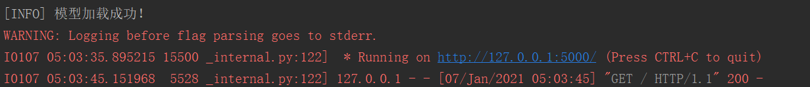
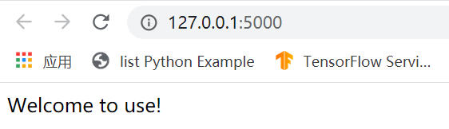
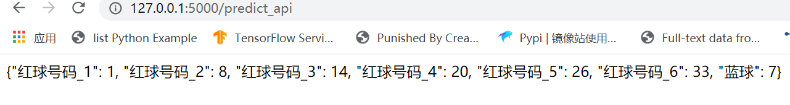

# 双色球彩票号码预测

项目比较简单，仅作为娱乐项目，但没想到关注人比预期要多，特此感谢大家关注，祝大家都能发财！
因为项目本身涉及到爬虫，机器学习，后端服务技术，而且是面向开发者的，我默认大家有这方面技术背景且能解决一些常识问题，故没有做太多细节说明，特此表示抱歉。
项目仅仅是抛砖引玉，很多地方都不是绝对的，目的是为了感兴趣的朋友可以自定义调试。

## Update
之前有issue反应，因为不同红球模型预测会有重复号码出现，所以将红球序列整体作为一个序列模型看待，推翻之前红球之间相互独立设定，
因为序列模型预测要引入crf层，相关API必须在 tf.compat.v1.disable_eager_execution()下，故整个模型采用 1.x 构建和训练模式，
在 2.x 的tensorflow中 tf.compat.v1.XXX 保留了 1.x 的接口方式。

## Getting Started
执行 python get_train_data.py 用于获取训练数据，
如果出现解析错误，应该看看网页 http://datachart.500.com/ssq/history/newinc/history.php 是否可以正常访问

执行 python train_model.py 开始模型训练，先训练红球模型，再训练蓝球模型，模型参数和超参数在 config.py 文件中自行配置
具体训练时间消耗与模型参数和超参数相关。

执行 python run_api.py 启动一个微服务，获取每天预测号码，获取预测访问url为: http://127.0.0.1:5000/predict_api
服务部署在后台，可以直接在浏览器上每日获取预测结果。

### Installing

python3.6 环境，相关库和版本在 requirements.txt 下

pip install -r requirement.txt

若安装存在问题，可手动依次安装，具体安装库产生问题，需自行解决

## Running the tests

